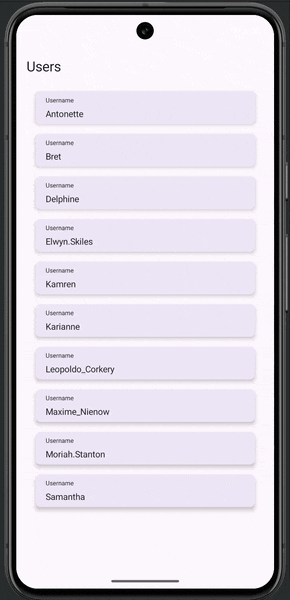

## 📱 Posts App KMP

A KMP practice project to apply my learnings from the [Appvanced](https://www.app-entwickler-werden.de/) course on software architecture, repositories, network calls, databases, dependency injection and migration from native code to KMP.

### 🧠 About the Project

Posts App displays a list of users and their corresponding posts, fetching data from the [JSON Placeholder API](https://jsonplaceholder.typicode.com/), sharing business logic, networking, and persistence across Android and iOS. 

This project demonstrates key concepts such as:
- Clean architectural structure (use cases, repositories, network layer)
- API integration with asynchronous data handling
- Separation of concerns and scalability in app design

### 🛠️ Built With

- Languages: Kotlin (KMP), Swift (iOS)
- Android UI: Jetpack Compose
- iOS UI: SwiftUI (using the shared KMP layer via KMP-ObservableViewModel)
- DI: Koin
- Networking: Ktor Client with JSON serialization
- Local data storage: Room

### 🌍 API Source

Data provided by [JSON Placeholder API](https://jsonplaceholder.typicode.com/)

### 📸 Preview

### 👩‍💻 Author

Created with 💙 by Carla von Eicken
[LinkedIn](https://www.linkedin.com/in/carla-von-eicken/) | [GitHub](https://github.com/carla-voneicken)
